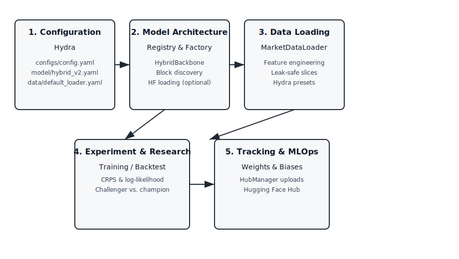

# Open Synth Miner

Open Synth Miner is a Hydra-driven research framework for Bittensor SN50 (Synth) that focuses on hybrid neural architectures, stochastic path simulation, and "build in public" tracking. Models are assembled from registry-driven blocks, trained to generate 1,000 differentiable price paths, and logged to Weights & Biases while automatically publishing artifacts to the Hugging Face Hub.

## Architecture Overview



The static SVG above mirrors the same flow shown in the earlier Mermaid diagram: Hydra configuration feeds the block registry a
nd hybrid backbone factory, the leak-safe data loader delivers features into the training/backtesting engine, and metrics/artifa
cts flow through Weights & Biases and the Hugging Face Hub for publishing.

## Key Features
- **Compositional Registry & Auto-Discovery**: Register components, blocks, and hybrids with decorators and load them recursively so recipes stay declarative even with thousands of modules. Hybrid backbones stitch blocks from YAML blueprints rather than monolithic classes, and legacy LSTM/Transformer setups translate into block recipes seamlessly.
- **Hydra-Native Model Recipes**: Define architectures via `_target_`-based configs (e.g., `configs/model/hybrid_v2.yaml`) that can include parallel fusion, SDE blocks, or other experimental modules. The universal factory supports fresh instantiation or loading from Hugging Face when `hf_repo_id` is provided.
- **Data Loading for Research & Backtesting**: The `MarketDataLoader` (Hydra-instantiable) produces windowed price tensors plus optional covariates for training or champion-vs-challenger comparisons, with deterministic slices for reproducible backtests.
- **Training Pipeline with Differentiable Simulation**: `run_experiment` builds models, simulates 1,000 paths end-to-end, logs CRPS/log-likelihood metrics, and surfaces architecture metadata for downstream publishing.
- **Challenger vs. Champion Backtests**: The backtest engine instantiates a challenger model and a champion loaded from the Hugging Face Hub, evaluates both on aligned datasets, computes interval CRPS/variance spread, and logs overlapping fan charts to W&B.
- **Hub & W&B Automation**: `HubManager` saves checkpoints under taxonomy-rich folders, uploads to `username/SN50-Hybrid-Hub`, generates model cards that link back to W&B runs, updates W&B summaries with HF links, and prints shareable reports for X/Twitter.

## Configuration
Hydra drives all experiments. The root config selects model/data defaults and toggles train vs. backtest modes:
```yaml
# configs/config.yaml
defaults:
  - model: hybrid_v2
  - data: default_loader

mode: train
project: synth-miner

training:
  batch_size: 4
  seq_len: 32
  feature_dim: 4
  horizon: 12
  n_paths: 1000
  lr: 0.001

backtest:
  champion_repo_id: username/SN50-Hybrid-Hub
  time_increment: 60
  horizon: 12
  n_paths: 1000
```

Model recipes use `_target_` entries so Hydra can instantiate nested blocks automatically:
```yaml
# configs/model/hybrid_v2.yaml
model:
  _target_: src.models.factory.SynthModel
  backbone:
    _target_: src.models.factory.HybridBackbone
    input_size: 4
    d_model: 32
    blocks:
      - _target_: src.models.registry.TransformerBlock
        d_model: 32
        nhead: 4
      - _target_: src.models.registry.LSTMBlock
        d_model: 32
        num_layers: 1
    validate_shapes: true  # default; ensures each block preserves (batch, seq, d_model)
  head:
    _target_: src.models.heads.GBMHead
    latent_size: 32
    sigma_min: 0.01
    sigma_max: 0.5
```

Data presets remain Hydra-friendly; `configs/data/default_loader.yaml` instantiates the canonical leak-safe loader with a `MockDataSource` and `ZScoreEngineer` so feature dimensions, model input size, and backtesting stay aligned.

## Usage
1. **Install and hydrate configs**
   ```bash
   python -m pip install -e .
   # Inspect available options
   python main.py --cfg job
   ```
   This ensures the package is importable (so component discovery works) and shows the full Hydra config tree you can override.

2. **Run training with auto-discovery**
   ```bash
   python main.py mode=train training.batch_size=8 training.horizon=12 training.n_paths=256
   ```
   The entrypoint discovers registry components under `src/models/components`, hydrates the model from YAML, runs a quick training/eval loop on a synthetic batch, logs CRPS/log-likelihood to W&B, then uploads the checkpoint and config summary via `HubManager`.

3. **Champion vs. Challenger backtest**
   ```bash
   python main.py mode=backtest data=default_loader backtest.champion_repo_id=username/SN50-Hybrid-Hub backtest.device=cuda:0
   ```
   This hydrates the leak-safe `MarketDataLoader`, loads a champion from Hugging Face, instantiates the challenger from the current config, evaluates both on the same price window, and logs overlapping fan charts and metrics to W&B.

4. **Customize architectures**
   - Add new blocks/components under `src/models/components/`; the auto-discovery step registers them at runtime.
   - Update `configs/model/*.yaml` to declare new hybrid recipes (including parallel fusion or partial blocks) without touching code.
   - Disable shape validation for experimental blocks by setting `model.backbone.validate_shapes=false` if a block legitimately changes feature/sequence dimensions.

5. **Programmatic usage (import as a package)**
   ```python
   import torch
   from omegaconf import OmegaConf
   from open_synth_miner import MarketDataLoader, create_model
   from src.data import MockDataSource, ZScoreEngineer

   cfg = OmegaConf.create(
       {
           "model": {
               "_target_": "src.models.factory.SynthModel",
               "backbone": {
                   "_target_": "src.models.factory.HybridBackbone",
                   "input_size": 3,
                   "d_model": 32,
                   "validate_shapes": True,
                   "blocks": [
                       {"_target_": "src.models.registry.TransformerBlock", "d_model": 32, "nhead": 4},
                       {"_target_": "src.models.registry.LSTMBlock", "d_model": 32},
                   ],
               },
               "head": {"_target_": "src.models.heads.GBMHead", "latent_size": 32},
           },
           "training": {"horizon": 12, "n_paths": 128, "feature_dim": 3},
       }
   )

   model = create_model(cfg)
   source = MockDataSource(length=512, freq="1h")
   engineer = ZScoreEngineer()
   loader = MarketDataLoader(
       data_source=source,
       engineer=engineer,
       assets=["BTC"],
       input_len=96,
       pred_len=cfg.training.horizon,
       batch_size=16,
       feature_dim=cfg.training.feature_dim,
   )
   sample = loader.dataset[0]
   history = sample["inputs"].T.unsqueeze(0)
   initial_price = torch.ones(history.shape[0])

   paths, mu, sigma = model(
       history,
       initial_price=initial_price,
       horizon=cfg.training.horizon,
       n_paths=cfg.training.n_paths,
   )
   print(paths.shape)  # (batch, n_paths, horizon)
   ```
   The top-level package exposes factories, registries, and data utilities so you can prototype without drilling into submodules. Always pass the full `DictConfig` (or at least the `model` node) into `create_model`/`get_model`; calling the raw `DictConfig` like a module will raise `TypeError: 'DictConfig' object is not callable`.

Shape validation runs during `HybridBackbone` construction to catch blocks that inadvertently change sequence length or feature size. If you intentionally use a block with dynamic output shapes (e.g., pooling), set `validate_shapes: false` in the backbone config to bypass the dummy-tensor probe.

## Hugging Face market data (tensorlink-dev/open-synth-training-data)
Use the leak-safe `MarketDataLoader` with the public Hugging Face Parquet dataset published at [`tensorlink-dev/open-synth-training-data`](https://huggingface.co/datasets/tensorlink-dev/open-synth-training-data). A minimal example:
```python
import pandas as pd
from src.data import HFParquetSource, MarketDataLoader, ZScoreEngineer

source = HFParquetSource(
    repo_id="tensorlink-dev/open-synth-training-data",
    filename="prices.parquet",  # choose a parquet file from the repo
    repo_type="dataset",  # ensure the Hub lookup hits the dataset endpoint
    asset_column="asset",
    price_column="price",
    timestamp_column="timestamp",
)
loader = MarketDataLoader(source, ZScoreEngineer(), assets=["BTC"], input_len=96, pred_len=24, batch_size=64)
train_dl, val_dl, test_dl = loader.static_holdout(pd.Timestamp("2023-01-01", tz="UTC"))
```
If you see a `401` while downloading, the repository may be private or gated; authenticate with `huggingface-cli login` or set
`HF_TOKEN` so the Hub request can resolve the parquet files.
See `docs/hf_market_data.md` for step-by-step instructions, walk-forward/hybrid examples, and safety notes.

## Directory Highlights
- `src/models/registry.py`: Component/block/hybrid registries plus recursive discovery for decorator-based registration.
- `src/models/factory.py`: Hydra-driven model creation (fresh or HF-loaded) and hybrid backbone wiring from recipes.
- `src/data/market_data_loader.py`: Canonical leak-safe market data loader with pluggable sources and feature engineering.
- `src/research/backtest.py`: Challenger-vs-champion engine computing interval CRPS and variance spread with W&B logging.
- `src/tracking/hub_manager.py`: Hugging Face + W&B bridge that uploads taxonomy-structured artifacts and emits shareable reports.
- `configs/`: Hydra configs for defaults, data presets, and hybrid model recipes.

## Notes
- Experiments rely on W&B for metrics, tables (fan charts), and artifact tracking; ensure `WANDB_API_KEY` is set.
- Hugging Face uploads use `huggingface_hub.HfApi`; set `HF_TOKEN` (or login) before running training flows that push artifacts.
